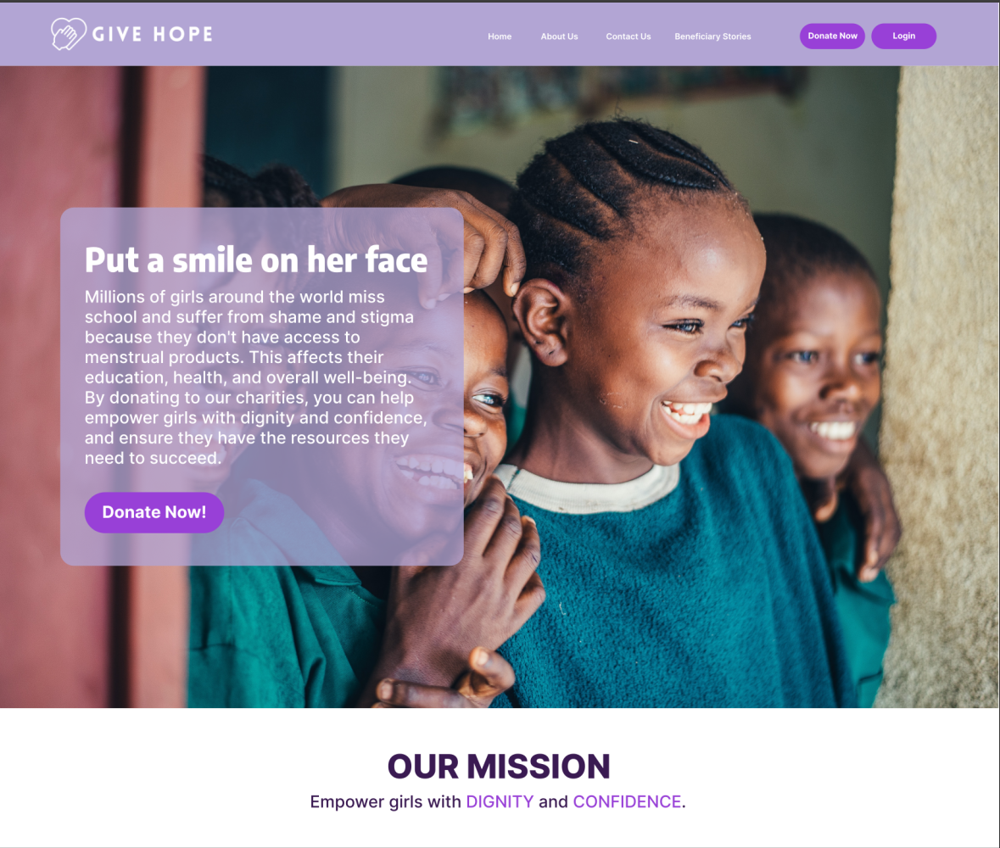
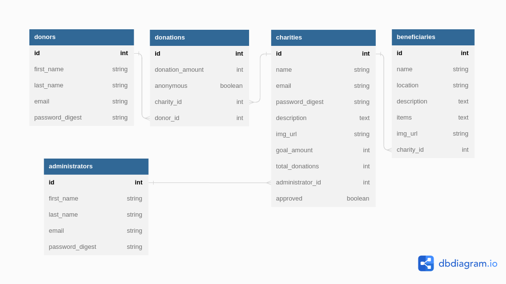

# Phase 5 Capstone Project: Donation Project - Give Hope

#### 11/04/2023 - 28/04/2023
### By Phase 5 Group 6
### Group Members
| Name      | Role |
| ----------- | ----------- |
| Osteen Mutinda      | Scrum Master and Full Stack Developer      |
| Glen Kimani   | Frontend Developer        |
| Jennifer Sammy   | Frontend Developer        |
| Joanna Oluoch   | Full Stack Developer         |
| Angeline Simiyu   | Backend Developer        |
| Antony Ehachi   | Frontend Developer        |

---
## Contents
* [Project Description](#project-description)
* [Setup Instructions](#setup-instructions)
* [BDD](#bdd)
* [Bugs](#bugs)
* [Technologies Used](#technologies-used)
* [License Information](#license)
* [Contact Details](#contacts)

---
<a name="project-description"></a>
## Project Description
This project is a Full Stack React-Rails application that aims to solve the problem of school-going girls in subsaharan countries being unable to access pads and other supplies needed for their periods, by creating a platform to raise funds and encouraging repeat donations. The platform is named **_Give Hope_** and it allows donors and charities to connect to raise funds to provide sanitary towels, clean water and sanitation facilities, to ensure they are able to meet the [guidelines for proper menstrual hygiene as defined by UNICEF](https://www.unicef.org/media/91341/file/UNICEF-Guidance-menstrual-health-hygiene-2019.pdf).<br><br>

The wireframe for the frontend is as shown below:

<br><br>
The Entity Relationship Diagram is as shown below:


<br>The relationship between the models is such that:
- A Donor has many Charities, through Donations.
- A Charity has many Donors, through Donations.
- A Donation belongs to a Donor, and belongs to a Donor.
- A Charity has many beneficiaries.
- A Beneficiary belongs to a Charity.
- An Administrator has many Charities.
- A Charity belongs to an Administrator.

---
<a name="setup-instructions"></a>
## Setup Instructions
1. Download the zip file under the 'Code' tab.
2. Extract files from the zip file.
3. Open the extracted folder with VS Code.
<br><br>
### Backend Setup Instructions
Navigate into the ``Backend`` folder first.<br>
1. In your VS Code terminal to install the required gems, run:
```sh
bundle install
```
2. In your VS Code terminal to migrate the database, run:
```sh
rails db:migrate
```
3. Still in the VS Code terminal, to seed data into the database, run the command below. This will populate the database with 1 Administrator instance, 3 Donor instances, 8 Charity instances, 6 Beneficiary instances, and 9 Donation instances. The number of instances can be changed in the [seeds.rb file](Backend/db/seeds.rb) if needed.
```sh
rails db:seed
```
4. Still in the VS Code terminal, to start the database, run the command below:
```sh
rails s

//You can close the server by pressing [Ctrl+C]
```
5. And then, you are good to go move on to the frontend setup. To test the backend alone, use a client like Postman or Chrome Browser, to test the application. You can use [this]() Postman collection to test out the routes.

### Frontend Setup Instructions
Navigate into the ``client`` folder first.<br>
1. In your VS Code terminal to install the required packages, run:
```sh
npm install
```
2. In your VS Code terminal with the Rails server already running, to start the React app, run:
```sh
npm start
```
<br>

---
<a name="bdd"></a>
## BDD
As a user, I will be able to carry out the following depending on the type of user I am:

### 1. Non-logged In User
- See a variety of charities I can donate to.
- Create an account on the platform.
- Choose a charity and view it's details.

### 2. Donor User
- See a variety of charities I can donate to.
- Create an account on the platform.
- Choose a charity and view it's details.
- Donate to a charity.
- Set up automated repeat donation or one-time donation.
- Choose whether to be an anonymous donor or not.
- Have reminders at the same time each month to donate.
- See stories about beneficiaries of my donations.
- Donate via paypal/stripe or any other third party service.

### 3. Charity User
- Apply to be a charity on the platform.
- Once the request has been approved by the administrator, I can set up charity details.
- View non-anonymous donors and their donations.
- View the amounts donated by anonymous donors.
- View the total amount donated to the charity.
- Create and post stories of beneficiaries.
- Maintain a list of beneficiaries as well as inventory sent to the beneficiaries.

### 4. Administrator User
- Receive and review applications from charities.
- Approve or reject applications.
- Delete charities.

---
<a name="bugs"></a>
## Bugs
There are no bugs in this project. If you encounter any new issues, please create an issue in the repository.

---
<a name="technologies-used"></a>
## Technologies Used
- Ruby - `ruby 3.0.5`
- Rails
- JWT Authentication
- Active Record
- SendGrid
- Cloudinary
- React JS
- Tailwind CSS
- Bootstrap CSS
<br>

---
<a name="license"></a>
## License
None.

---
<a name="contacts"></a>
## Contacts
For any queries feel free to reach out at the contacts below:
- Email: givehopecharities@gmail.com